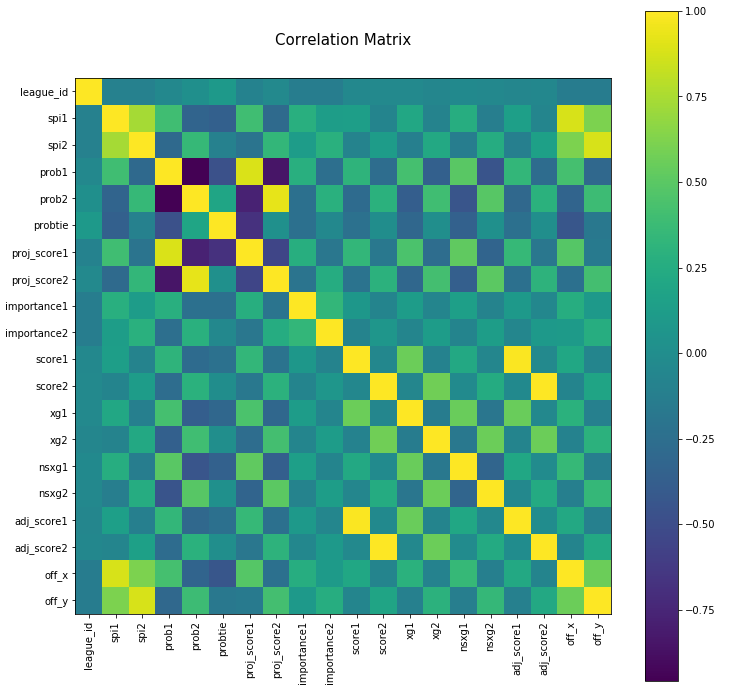
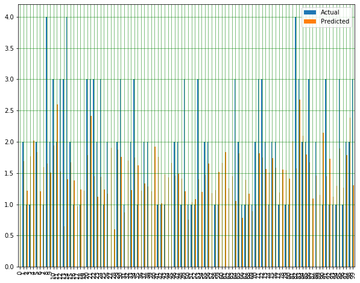
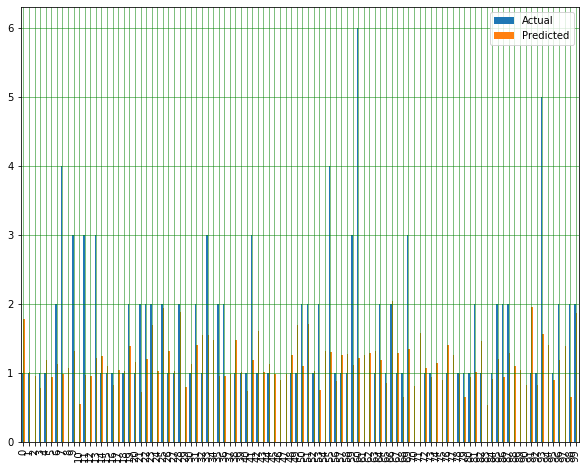

Majour Leagues
==============================

Regression Project

## Introduction:
The project is about building a regression model to determine the score of each team in matches using other columns as features.

The data was obatined from the following link:

https://github.com/fivethirtyeight/data/tree/master/soccer-spi

The data are contained in the files spi_global_rankings.csv, spi_global_rankings_intl.csv, spi_matches.csv.

## Approach:
Exploratory data analysis and feature engineering were first performed before building two regression models. The regression models built were linear regression, random forest and logisitic regression.

The correlation matrix was obtained in order to find out the correlation between features.

### 1. Linear Regression
The basic approach is to use linear regression in order to predict the scores using other column features.
The columns used for building the linear regression model are: (spi1, spi2, prob1 , prob2 , importance1, importance2, proj_score1, proj_score2, off_team1, off_team2)

The mean absolute error, mean square error and the root squared error was calculated for the linear regression model.

### Score1 Accuracy

### Score2 Accuracy

### 2. Ramdom Forest
The basic approach is to use a random forest model in order to predict the scores using other column features.
The columns used for building the linear regression model are: (spi1, spi2, prob1 , prob2 , importance1, importance2, proj_score1, proj_score2, off_team1, off_team2)

### 3. Logistic Regression
Logistic regression is a statistical machine learning algorithm that classifies the data by considering outcome variables on extreme ends and tries makes a logarithmic line that distinguishes between them. The columns used for building the logistic regression model are: (spi1, spi2, prob1 , prob2 , importance1, importance2, proj_score1, proj_score2, off_team1, off_team2)

## Discussion and Conclusion:
A linear regression model, random forest and logistic regression models were built. The model predicts the scores of teams competing in a soccer game. 
For each score the Mean Absolute Error, Mean Squared Error and the Root Mean Squared Error was calculated.
Below is the summary for the mean square errors for different models:
#### 1. Linear Regression
* Mean Squared Error for score1: 1.397
* Mean Squared Error for score2: 1.214

#### 2. Random Forest
* Mean Squared Error for score1: 1.617 
* Mean Squared Error for score2: 1.285

#### 3. Logistic Regression
* Mean Squared Error for score1: 1.836
* Mean Squared Error for score2: 1.495

#### The best model was the linear regression model.

