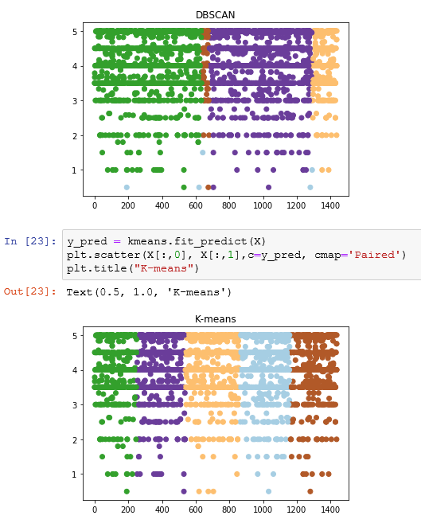

Blockbuster or art film?
==============================

Data Clustering Project

WEEKEND MOVIE TRIP

## Introduction:

The project is about building a clustering model to determine similar moves  to recommend using the ratings and tags by other users as features.

The data was obatined from the following link:

Data Source: https://grouplens.org/datasets/movielens/ small data set

The data are contained in the files links.csv, movies.csv, ratings.csv and tags.csv.

## Approach:

### Kmeans
The first approach is a movie recommendation model using K-means clustering (to recommend similar movies to the user). The two features extracted from the dataset include: Average Movie Rating and Tags. The elbow method was used to determine the best number of clusters to use the best number of clusters. The number of clusters was chosen to be 5 and the clustering was based on the Average Movie Rating and Tags.

### DBSCAN
Density-based spatial clustering of applications with noise (DBSCAN) is a well-known data clustering algorithm that is commonly used in data mining and machine learning.
Based on a set of points, DBSCAN groups together points that are close to each other based on a distance measurement (usually Euclidean distance) and a minimum number of points. It also marks as outliers the points that are in low-density regions.

## Discussion:
K-means clustering was used to recommend similar movies to users. The clustering was based on the Average Movie Ratings and Tags. The clusters of similar movies was put together and the top 20 movies in each cluster was printed. 

The other approach the was used is DBSCAN. We noticed that there is an overlap between kmeans and DBscans when clustering moveies
There is almost an identical cluster and two of the k-means clusters can be combined to get the DBSCAN cluster. Another two clusters can also be combined to get the other kmeans cluster.

## Comparing DBSCAN with Kmeans

