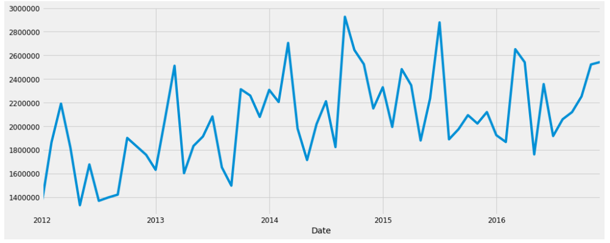

World Wide Products Inc
==============================

Time Series Project

## Introduction:
The project is about building one or more forecasting models to determine the demand for a particular product using other columns as features. The dataset contains historical product demand for a manufacturing company with footprints globally. The company provieds thousands of products within dozens of product categories. 

The data was obatined from the following link:

https://www.kaggle.com/felixzhao/productdemandforecasting

The data contains one csv file "Historical Product Demand.csv".

## Approach:

### 1. ARIMA
The basic approach is to apply the most commonly used method for time-series forecasting known as ARIMA. ARIMA stands for Autoregressive Integrated Moving Average.
ARIMA models are denoted with the notation ARIMA(p, d, q). These three parameters account for seasonality, trend, and noise in data. 

### 2.Fbprophet
Fbprophet implements a procedure for forecasting time series data based on an additive model where non-linear trends are fit with yearly, weekly, and daily seasonality, plus holiday effects. It works best with time series that have strong seasonal effects and several seasons of historical data. Prophet is robust to missing data and shifts in the trend, and typically handles outliers well. Fbprophet was applied to one of the products to forecast its demand.

## Discussion:
#### ARIMA
Arima was used to predict the order demand

The Mean Squared Error of our forecasts was 9.23

The Root Mean Squared Error of our forecasts was 3.04

#### Fbprophet
After using the fbprophet time series forecasting model for Product_1295 following observations can be made:

Demand for this product is increasing from 2012 to 2018

As for the yearly trend, there is a maximum increase in demand from March to July

For the weekly trend, demand is highest on wedensday and lowest on sunday

